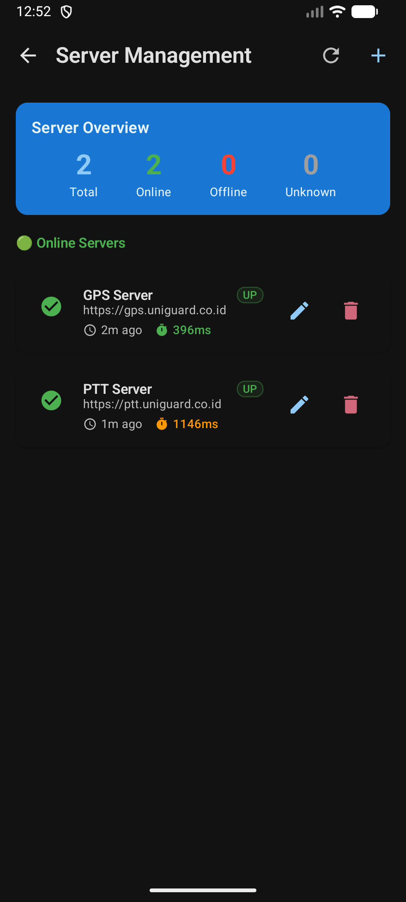
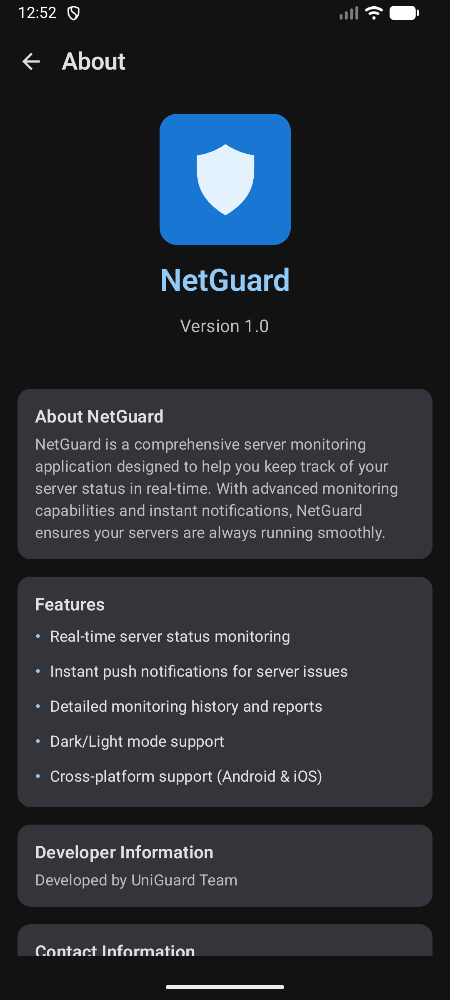

# NetGuard - Server Monitoring App

NetGuard is a comprehensive server monitoring application built with Kotlin Multiplatform, designed to help employees stay informed about server status and ensure timely maintenance. The app provides real-time server monitoring, incident reporting, and comprehensive analytics to keep your infrastructure running smoothly.

## Features

### 🔍 Server Monitoring

- **Real-time Monitoring**: Continuous server status tracking with automatic background checks
- **Push Notifications**: Instant alerts when servers go down or recover
- **Multi-platform Support**: Available on both Android and iOS devices

### 📊 Dashboard & Analytics

- **Visual Dashboard**: Clean, intuitive interface showing server status at a glance
- **Incident History**: Complete log of server downtime and recovery events
- **Reporting System**: Generate detailed reports on server performance and incidents

### 👥 User Management

- **Secure Authentication**: JWT-based login and registration system
- **Profile Management**: Update user information and preferences
- **Password Security**: Change password functionality with validation

### 🎨 User Experience

- **Dark/Light Theme**: Toggle between themes for comfortable viewing
- **Multi-language Support**: English and Indonesian language options
- **Responsive Design**: Optimized for both mobile platforms

### 🛠️ Technical Features

- **Background Monitoring**: Scheduled server checks even when app is closed
- **Offline Support**: Local data storage for offline access
- **Firebase Integration**: Push notifications via Firebase Cloud Messaging
- **SQLite Database**: Local data persistence with SQLDelight

## Architecture

This project is built using Kotlin Multiplatform with the following structure:

- **composeApp/**: Shared code across Android and iOS platforms

  - `commonMain/`: Platform-agnostic code (business logic, UI, networking)
  - `androidMain/`: Android-specific implementations
  - `iosMain/`: iOS-specific implementations

- **iosApp/**: iOS application entry point and SwiftUI components

## Tech Stack

- **Language**: Kotlin Multiplatform
- **UI Framework**: Jetpack Compose Multiplatform
- **Networking**: Ktor HTTP Client
- **Database**: SQLDelight
- **Dependency Injection**: Koin
- **Serialization**: Kotlinx.serialization
- **Push Notifications**: Firebase Cloud Messaging
- **Background Tasks**: WorkManager (Android), Background Tasks (iOS)

## Getting Started

### Prerequisites

- JDK 21 or higher
- Android Studio (for Android development)
- Xcode (for iOS development)
- Kotlin Multiplatform plugin

### Build and Run

#### Android

```bash
./gradlew :composeApp:assembleDebug
```

#### iOS

Open the `iosApp` directory in Xcode and run the project.

## API Integration

The app communicates with a REST API backend that provides:

- User authentication endpoints
- Server management APIs
- Incident reporting and history
- Real-time server status updates

See [API_DOCUMENTATION.md](./API_DOCUMENTATION.md) for detailed API specifications.

## Contributing

1. Fork the repository
2. Create your feature branch (`git checkout -b feature/AmazingFeature`)
3. Commit your changes (`git commit -m 'Add some AmazingFeature'`)
4. Push to the branch (`git push origin feature/AmazingFeature`)
5. Open a Pull Request

## License

This project is licensed under the MIT License - see the LICENSE file for details.

## Support

For support and questions, please open an issue on GitHub or contact the development team.

---

## Screenshots

| Dashboard | Server Management | Reports | About |
|-----------|-------------------|---------|-------|
|  |  |  |  |

---

Built with ❤️ using Kotlin Multiplatform
